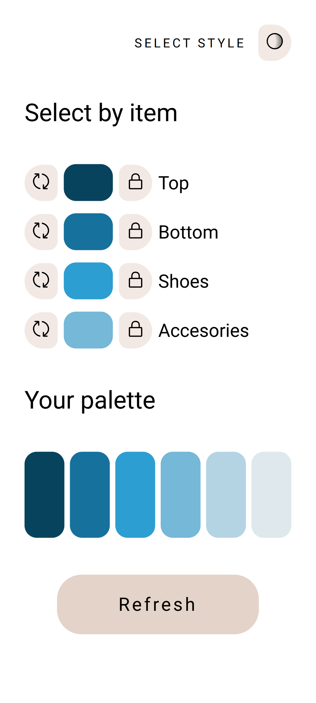
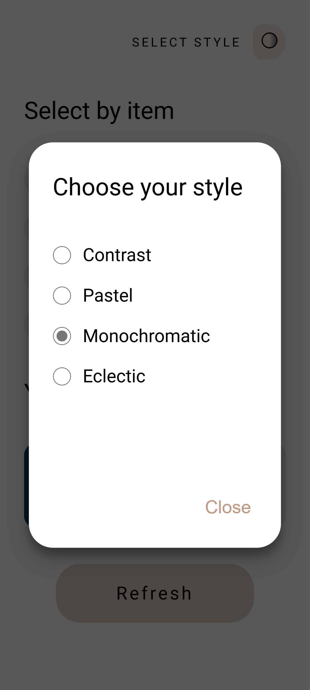
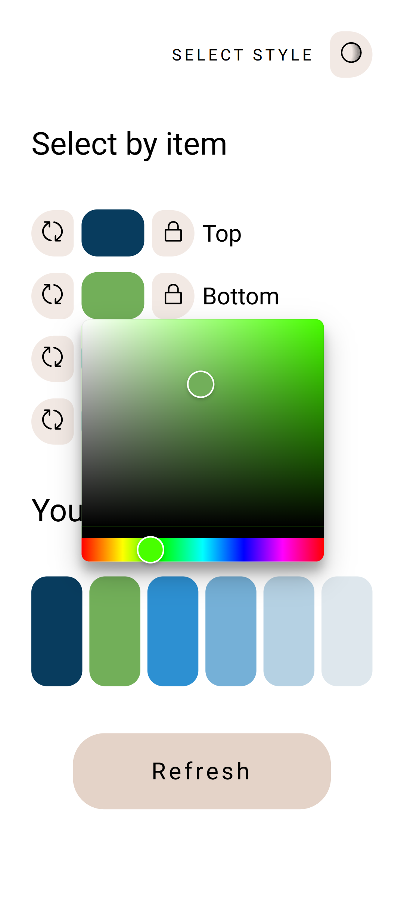

# colorplay

## Description
Colorplay is a small project inspired by the book *A Dictionary of Color Combinations* by Sanzo Wada, with the intention of simplifying the combination of colors when choosing clothes, and allow the user to experiment with different styles.

## Features
- Generate color palettes
- Select different styles for palette generation
- Customize palette by modifying colors individually

## Screenshots
    

## Project Status
Here's the current development status of this project:

- [x] Main page
- [x] Palette page
- [x] Palette style selector
- [x] Color picker
- [x] Random single color
- [x] Mobile version
- [ ] Desktop version
- [ ] Lock individual colors
- [ ] Testing
- [x] Live demo

## Installation

```bash
git clone https://github.com/MariaCaribou/colorplay.git
cd colorplay
```

### Client
```bash
cd client
npm install
npm run dev
```

### Server
```bash
cd server
npm install
npm start
```

## Tech Stack
- React (using Vite)
- Node
- Express